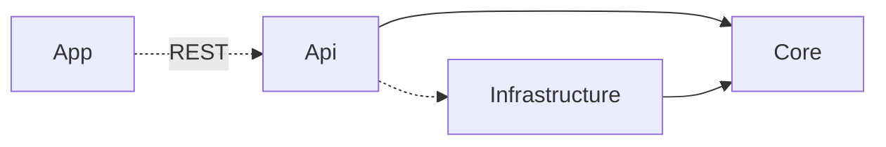
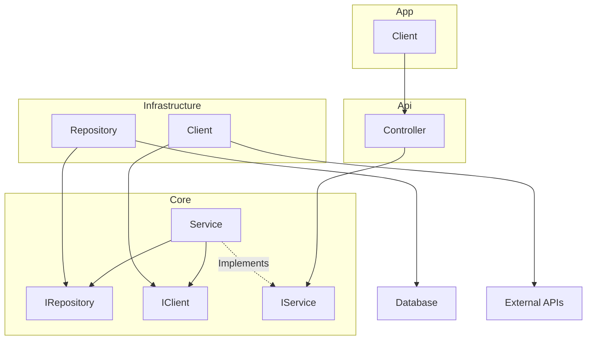

# Overview

This repository tries its best to follow [Clean Architecture](https://blog.cleancoder.com/uncle-bob/2012/08/13/the-clean-architecture.html).

However, it combines the typical _Use Cases/Application_ layer with the _Entities_ layer to create a single "Core" layer. 
This Core layer contains all of the entities and business logic of the system.

## Project Relationships

The solid arrows represent build dependencies and the dotted arrows represent runtime dependencies. The App project communicates to the API project via REST, 
so I classify it as more of runtime dependency than a build dependency.

The reason the API has a runtime dependency on the Infrastructure project is because it needs to register services that the Infrastructure project uses.

## Dependencies Between Major Components

The solid arrows represent dependencies between each component. Business logic is located in the `Service` component, 
which depending on it's implementation, could require a dependency on either an `IRepository` or an `IClient`.
